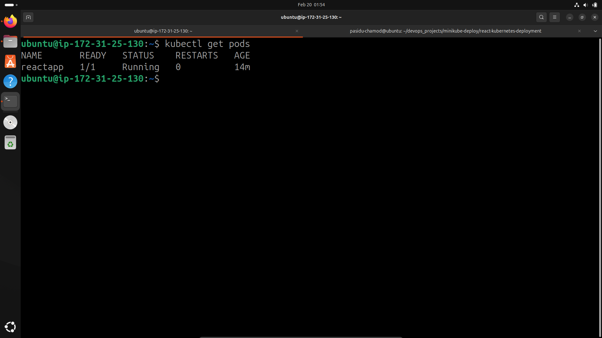
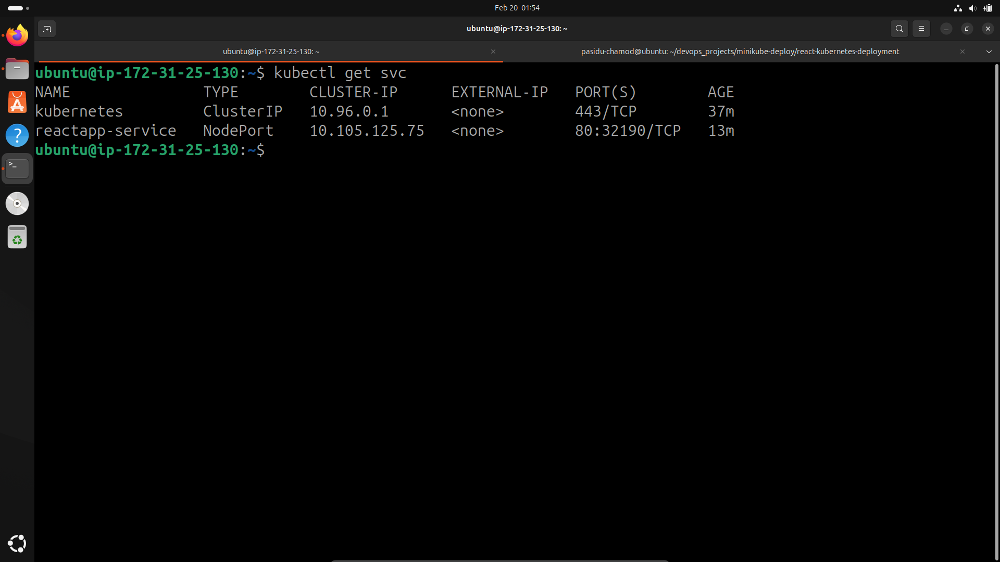
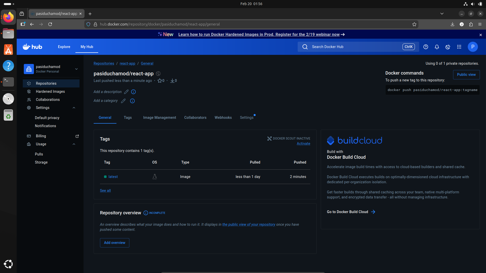
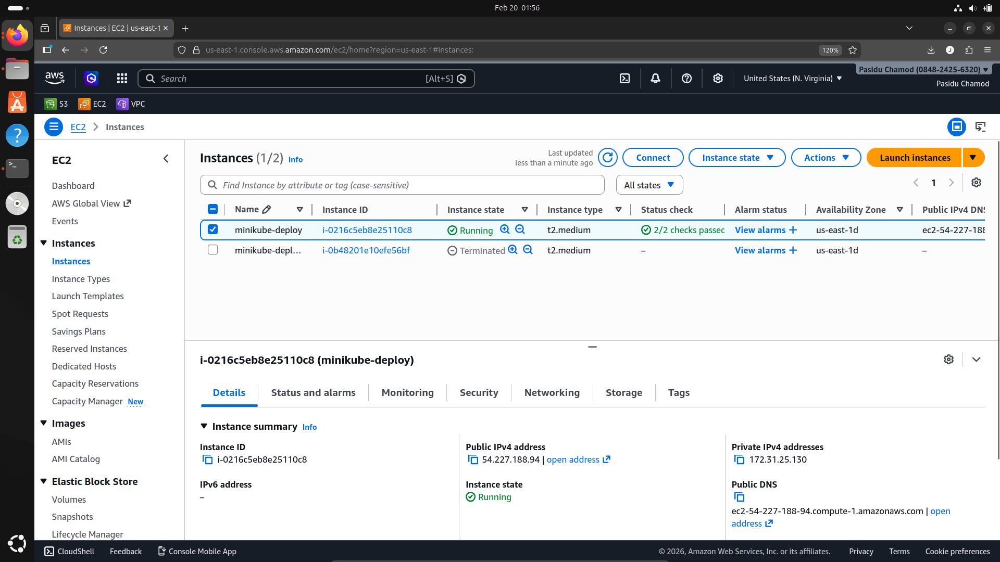

# 🚀 React App Deployment on Kubernetes with Minikube


This project demonstrates a complete **DevOps workflow** for deploying a **React application** using **Docker** and **Kubernetes** on an **AWS EC2 instance**. The app is containerized, pushed to **Docker Hub**, and orchestrates using **Minikube** to expose the service via a public IP.

---

## 📖 Table of Contents
- [Project Overview](#project-overview)
- [Tech Stack](#tech-stack)
- [Deployment Steps](#deployment-steps)
- [Screenshots](#screenshots)
- [Accessing the App](#accessing-the-app)
- [Author](#author)

---

## 🧐 Project Overview
This project showcases the end-to-end deployment lifecycle of a modern web application:
1. **Build**: Bundle the React app using **Vite** for optimized production assets.
2. **Containerize**: Create a lightweight **Docker image** with Nginx.
3. **Publish**: Push the image to **Docker Hub** for accessibility.
4. **Deploy**: Orchestrate the app on **Kubernetes** using **Minikube**.
5. **Expose**: Configure a Kubernetes Service to access the app via a public IP.

---

## 🛠️ Tech Stack
| Component | Technology | Description |
|-----------|------------|-------------|
| **Frontend** | React (Vite) | Fast, modern frontend framework |
| **Containerization** | Docker | Minimalist container runtime |
| **Orchestration** | Kubernetes (Minikube) | Local K8s cluster for testing |
| **Cloud Infrastructure** | AWS EC2 | Virtual server for hosting |
| **Registry** | Docker Hub | Image storage and distribution |
| **Web Server** | Nginx | High-performance web server |

---

## 🚀 Deployment Steps

### 1. Clone the Repository
Start by cloning the project to your local machine or EC2 instance.
```bash
git clone https://github.com/Pasiduchamod/react-kubernetes-deployment.git
cd react-kubernetes-deployment
```

### 2. Build the Docker Image
Create the Docker image from the Dockerfile.
```bash
docker build -t pasiduchamod/react-app:latest .
```

### 3. Push to Docker Hub
Authenticate and push the image to your Docker Hub repository.
```bash
docker login
docker push pasiduchamod/react-app:latest
```

### 4. Deploy to Kubernetes
Apply the deployment and service configurations to your Minikube cluster.
```bash
# Apply the deployment configuration
kubectl apply -f deployment.yaml

# Create the service to expose the app
kubectl apply -f service.yaml
```

### 5. Verify Deployment
Check the status of your pods and services to ensure everything is running correctly.
```bash
# Check running pods
kubectl get pods

# Check services
kubectl get svc
```

---

## 📸 Screenshots

### 1. Kubernetes Pods Running
> 
> *Status of pods running successfully in the cluster: ensuring high availability and scalability.*

### 2. Kubernetes Services
> 
> *Service configuration exposing the application: managing internal and external traffic flow.*

### 3. React App in Browser
> 
> *The deployed application accessed via public IP: demonstrating live accessibility.*

### 4. Docker Hub Repository
> 
> *Container image stored in Docker Hub registry: versioned and ready for deployment.*


### 5. AWS Cloud Infrastructure
> 
> *AWS EC2 instance hosting the Kubernetes cluster.*

---

## ✍️ Author
**Pasidu Chamod**

- 🐙 **GitHub:** [PasiduChamod](https://github.com/Pasiduchamod)
- 💼 **LinkedIn:** [PasiduChamod](https://linkedin.com/in/pasiduchamod)

---
